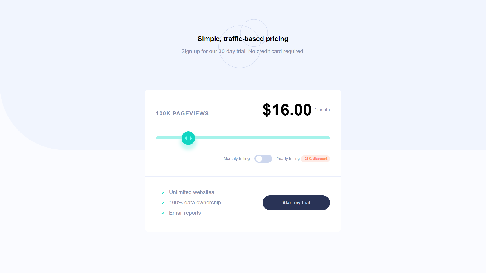

# Frontend Mentor - Interactive pricing component solution

This is a solution to the [Interactive pricing component challenge on Frontend Mentor](https://www.frontendmentor.io/challenges/interactive-pricing-component-t0m8PIyY8). Frontend Mentor challenges help you improve your coding skills by building realistic projects.

## Table of contents

- [Overview](#overview)
  - [The challenge](#the-challenge)
  - [Screenshot](#screenshot)
  - [Links](#links)
- [My process](#my-process)
  - [Built with](#built-with)
  - [What I learned](#what-i-learned)
  - [Useful resources](#useful-resources)
- [Author](#author)

## Overview

### The challenge

Users should be able to:

- View the optimal layout for the app depending on their device's screen size
- See hover states for all interactive elements on the page
- Use the slider and toggle to see prices for different page view numbers

### Screenshot

### Links

- Solution URL: [https://www.frontendmentor.io/solutions/interactive-pricing-component-vanilla-typescript-EKOcThH_Yx](https://www.frontendmentor.io/solutions/interactive-pricing-component-vanilla-typescript-EKOcThH_Yx)
- Live Site URL: [https://esealli.github.io/interactive-pricing-component/](https://esealli.github.io/interactive-pricing-component/)

## My process

### Built with

- Semantic HTML5 markup
- CSS custom properties
- Flexbox
- CSS Grid
- Mobile-first workflow
- TypeScript

### What I learned

I learnt how to use Typescript in a vanilla js project. I also learnt how to style the range input type.

### Useful resources

- [Styling range input with CSS and JavaScript for better UX](https://nikitahl.com/style-range-input-css) - This helped me understand how to properly style a range input

- [TypeScript Documentation](https://www.typescriptlang.org/docs/handbook/2/everyday-types.html) - This helped me understand how to set up typescript and understand the primart types in typescript.

## Author

- Website - [Eseoghene Alli](https://esealli.github.io/)
- Frontend Mentor - [@EseAlli](https://www.frontendmentor.io/profile/EseAlli)
